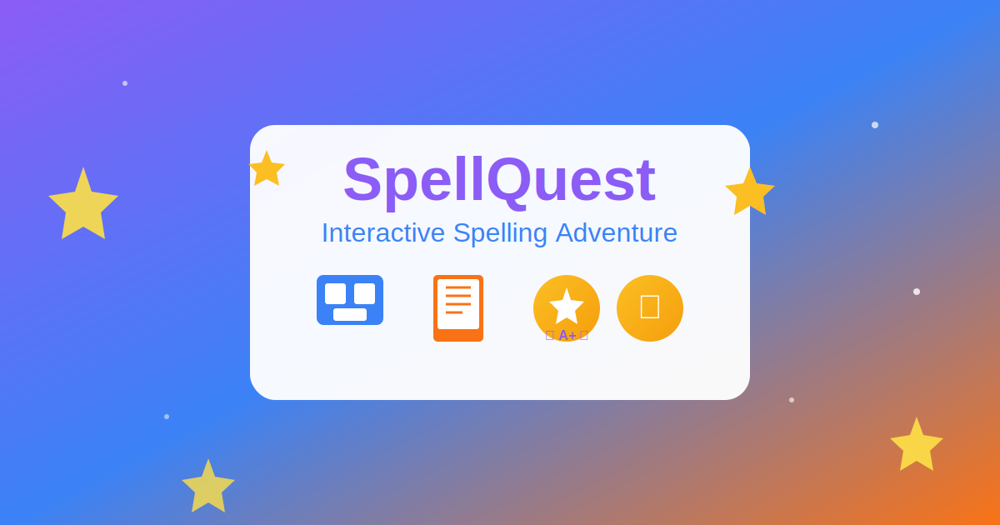

# SpellQuest - Interactive Spelling Enhancement App

An engaging, gamified spelling practice application designed for students who struggle with phonetic spelling errors. Built with Next.js, TypeScript, and Tailwind CSS.



## Features

### 🎮 Interactive Games
- **Spelling Bee**: Listen to words and spell them correctly
- **Complete the Word**: Fill in missing letters with hint support
- **Spot the Spelling**: Choose the correct spelling from challenging options
- **Pattern Sorter**: Categorize words by spelling patterns (silent letters, double letters, vowel teams, etc.)

### 📊 Progress Tracking
- Diagnostic assessment to identify spelling weaknesses
- Daily practice schedules with streak tracking
- Detailed analytics and progress reports
- Achievement system with unlockable badges

### ✍️ Creative Writing
- Story-based writing prompts with detailed guidelines
- Built-in spell checker
- Draft saving and project management

### 👤 Profile Customization
- 8 unique avatar options
- Theme color selection
- Title customization
- Progress and stats display

## Tech Stack

- **Framework**: Next.js 14 (App Router)
- **Language**: TypeScript
- **Styling**: Tailwind CSS
- **UI Components**: Radix UI, shadcn/ui
- **Database**: PostgreSQL with Prisma ORM
- **Authentication**: NextAuth.js
- **Animations**: Framer Motion
- **Charts**: Recharts

## Getting Started

### Prerequisites

- Node.js 18+ 
- PostgreSQL database
- Yarn package manager

### Installation

1. **Clone the repository**
   ```bash
   git clone https://github.com/YOUR_USERNAME/spellquest.git
   cd spellquest
   ```

2. **Install dependencies**
   ```bash
   yarn install
   ```

3. **Set up environment variables**
   ```bash
   cp .env.example .env
   ```
   Then edit `.env` with your database URL and NextAuth secret.

4. **Set up the database**
   ```bash
   yarn prisma generate
   yarn prisma db push
   ```

5. **Seed the database (optional)**
   ```bash
   yarn prisma db seed
   ```

6. **Run the development server**
   ```bash
   yarn dev
   ```

7. Open [http://localhost:3000](http://localhost:3000) in your browser.

## Project Structure

```
nextjs_space/
├── app/
│   ├── api/              # API routes
│   ├── dashboard/        # Main app pages
│   │   ├── exercises/    # Spelling games
│   │   ├── writing/      # Creative writing
│   │   ├── analytics/    # Progress tracking
│   │   ├── profile/      # User profile
│   │   └── ...
│   ├── login/            # Authentication
│   └── signup/
├── components/           # Reusable UI components
├── lib/                  # Utilities and config
│   ├── curriculum-data.ts  # Word lists and patterns
│   ├── auth-options.ts     # NextAuth config
│   └── db.ts               # Prisma client
├── prisma/
│   └── schema.prisma     # Database schema
└── public/               # Static assets
```

## Database Schema

Key models:
- **User**: Authentication and profile data
- **DiagnosticResult**: Assessment scores
- **ExerciseResult**: Game performance tracking
- **WritingProject**: Creative writing submissions
- **UserProgress**: Overall learning progress
- **DailyActivity**: Streak and daily stats

## Deployment

### Environment Variables for Production

Make sure to set these environment variables in your deployment platform:

- `DATABASE_URL` - PostgreSQL connection string
- `NEXTAUTH_SECRET` - Random secret for session encryption
- `NEXTAUTH_URL` - Your production URL

### Deploy to Vercel

[](https://vercel.com/new/clone?repository-url=https://github.com/YOUR_USERNAME/spellquest)

## Contributing

Contributions are welcome! Please feel free to submit a Pull Request.

## License

MIT License - feel free to use this project for personal or educational purposes.

---

Built with ❤️ for learners everywhere
